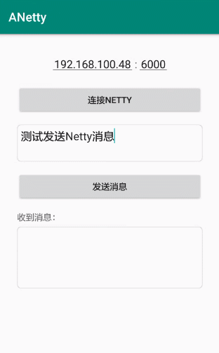

# ANetty


[](https://raw.githubusercontent.com/jenly1314/ANetty/master/app/release/app-release.apk)
[](https://jitpack.io/#jenly1314/ANetty)
[](https://travis-ci.org/jenly1314/ANetty)
[](https://android-arsenal.com/api?level=16)
[](http://www.apache.org/licenses/LICENSE-2.0)
[](http://blog.csdn.net/jenly121)
[](http://shang.qq.com/wpa/qunwpa?idkey=8fcc6a2f88552ea44b1411582c94fd124f7bb3ec227e2a400dbbfaad3dc2f5ad)

ANetty for Android 是基于Netty二次封装的Android链路通讯库，用以快速开发高性能，高可靠性的网络交互。在保证易于开发的同时还保证其应用的性能，稳定性和伸缩性。


## Gif 展示



## 引入

### Maven：
```maven
    <dependency>
      <groupId>com.king.anetty</groupId>
      <artifactId>anetty</artifactId>
      <version>1.0.0</version>
      <type>pom</type>
    </dependency>
```
### Gradle:
```gradle
    implementation 'com.king.anetty:anetty:1.0.0'
```
### Lvy:
```lvy
    <dependency org='com.king.anetty' name='anetty' rev='1.0.0'>
      <artifact name='$AID' ext='pom'></artifact>
    </dependency>
```

###### 如果Gradle出现compile失败的情况，可以在Project的build.gradle里面添加如下：（也可以使用上面的GitPack来complie）
```gradle
    allprojects {
        repositories {
            maven { url 'https://dl.bintray.com/jenly/maven' }
        }
    }
```

## 引入的库：
```gradle
    compileOnly 'com.android.support:appcompat-v7:28.0.0'
```

## 示例

代码示例

> ANetty暂并不提供Netty服务端封装库，因为在真实的场景中，服务端一般都依赖项目对应的业务。为了方便演示客户端效果，有个简易的[服务端demo](server)，直接以Java的形式直接运行ANettyServer即可启动Netty服务

Netty服务端：
```Java
    //初始化并启动服务
    new ANettyServer().start(String host,int port);
```

Netty客户端：
```Java
    //初始化Netty
    mNetty = new ANetty(new Netty.OnChannelHandler() {
        @Override
        public void onMessageReceived(String msg) {
            //TODO 接收到消息
        }

        @Override
        public void onExceptionCaught(Throwable e) {

        }
    }, true);
    //设置连接监听
    mNetty.setOnConnectListener(new Netty.OnConnectListener() {
        @Override
        public void onSuccess() {
            //TODO 连接成功
        }

        @Override
        public void onFailed() {
            //TODO 连接失败
        }

        @Override
        public void onError(Exception e) {
            //TODO 连接异常
            Log.e(ANetty.TAG,e.getMessage());
        }
    });

    //初始化后，连接Netty
    mNetty.connect(String host,int port);

```

更多使用详情，请查看[app](app)中的源码使用示例

## 版本记录

#### v1.0.0：2019-3-30
*  ANetty初始版本

## 赞赏
如果您喜欢ANetty，或感觉ANetty帮助到了您，可以点右上角“Star”支持一下，您的支持就是我的动力，谢谢 :smiley:<p>
您也可以扫描下面的二维码，请作者喝杯咖啡 :coffee:
    <div>
        
        
        
        
    </div>

## 关于我
   Name: <a title="关于作者" href="https://about.me/jenly1314" target="_blank">Jenly</a>

   Email: <a title="欢迎邮件与我交流" href="mailto:jenly1314@gmail.com" target="_blank">jenly1314#gmail.com</a> / <a title="给我发邮件" href="mailto:jenly1314@vip.qq.com" target="_blank">jenly1314#vip.qq.com</a>

   CSDN: <a title="CSDN博客" href="http://blog.csdn.net/jenly121" target="_blank">jenly121</a>

   Github: <a title="Github开源项目" href="https://github.com/jenly1314" target="_blank">jenly1314</a>

   加入QQ群: <a title="点击加入QQ群" href="http://shang.qq.com/wpa/qunwpa?idkey=8fcc6a2f88552ea44b1411582c94fd124f7bb3ec227e2a400dbbfaad3dc2f5ad" target="_blank">20867961</a>
   <div>
       
       
   </div>


